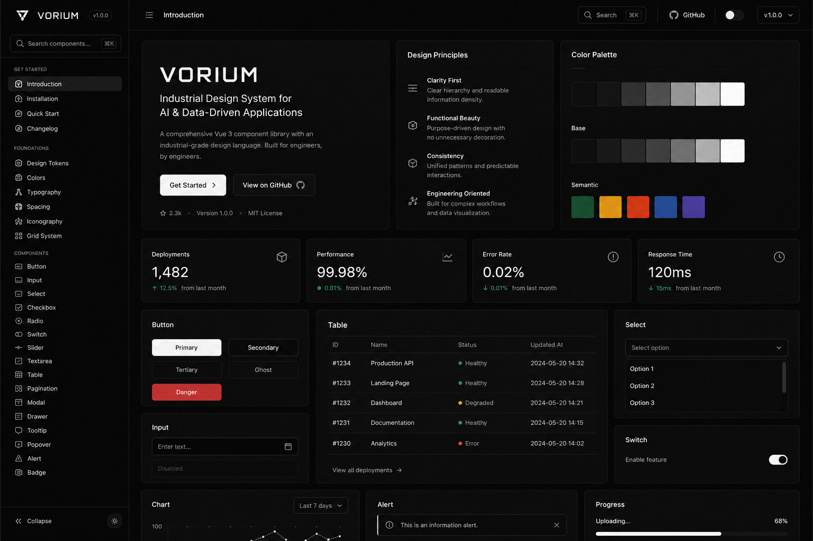

# VORIUM UI

<h1 align="center">VORIUM UI</h1>

  <strong>Industrial Minimalism Design System for Vue 3</strong>

  Built for AI Infrastructure, Semiconductor Platforms, and Engineering Dashboards

  🚧 Currently under Planning & Architecture Phase

  

---

## Overview

VORIUM UI is an upcoming open-source design system and component library built for modern industrial software.

Unlike traditional UI libraries that focus on consumer applications, VORIUM is designed specifically for:

- Semiconductor Manufacturing Platforms
- Industrial AI Systems
- Engineering Operations Software
- Data-Dense Dashboards
- Edge AI Applications
- Digital Twin Platforms
- Infrastructure Monitoring Systems

The project aims to provide a unified design language and reusable component ecosystem for complex engineering workflows.

---

## Design Philosophy

VORIUM follows an **Industrial Minimalism** design philosophy.

### Core Principles

- High information density
- Functional over decorative
- Engineering-first UX
- Consistent visual hierarchy
- Low visual noise
- Scalable design tokens
- Dark mode as primary experience

### Visual Direction

Inspired by:

- Linear
- Vercel
- Datadog
- NVIDIA AI Platforms
- Semiconductor Manufacturing Systems
- Industrial Control Software

---

## Vision

Modern software engineers have many UI frameworks available.

Industrial engineers do not.

VORIUM aims to become a dedicated design system for:

- Semiconductor Engineers
- AI Engineers
- Manufacturing Engineers
- Data Center Operators
- Industrial Software Teams

By combining modern frontend technologies with industrial workflow requirements, VORIUM seeks to bridge the gap between enterprise software and engineering productivity.

---

## Timeline

| Milestone | Target Date | Status |
|------------|------------|----------|
| Project Initiation | 2026-05-30 | ✅ Completed |
| Core Components Development | 2026-06 | 🚧 In Progress |
| Documentation Website | 2027-01 | ⏳ Planned |
| Alpha Release (v0.1.0) | 2027-03 | ⏳ Planned |
| Beta Release (v0.5.0) | 2027-05 | ⏳ Planned |
| Stable Release (v1.0.0) | 2027-06 | ⏳ Planned |

---

## Author

### Lin Ying-Hao

Institute of Semiconductor Research in National Tsing Hua University

Areas of Interest:

- Semiconductor Technology
- AI Acceleration Hardware
- Compute-In-Memory (CIM)
- Human-Computer Interaction
- Frontend Engineering
- Design Systems

Website:

- https://sclemon1013.com

---

## Contributing

Contributions, discussions, and design feedback will be welcomed once development begins.

If you are interested in:

- Industrial UI Design
- Vue Ecosystem
- Design Systems
- AI Infrastructure Dashboards
- Semiconductor Software

Feel free to open an issue or start a discussion.

---

## License

MIT License

---

  Built for Industrial Intelligence.

  VORIUM UI © 2026

